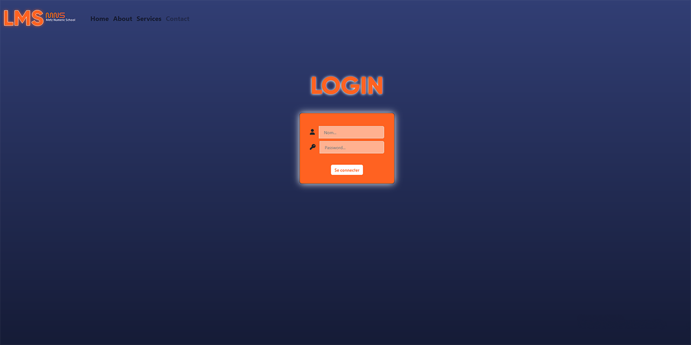

# LMS - plateforme de Formation

## Qu'est ce que c'est ?
Ceci est un prototype développé en quelques jours pour l'examen final de ma formation à **MNS**.
Il a été réalisé avec l'aide de **Youness LANDROIT** qui s'est occupé de la partie backend en partie et du back-office.
J'ai réalisé la partie API de Django et la partie frontend.

## Framework utilisés
 - Django pour le backend.
 
 - Django REST Framework pour l'API.
 
 - VueJS pour le frontend.
 

## Deploiement
### Notes
Initialement prévu pour être totalement déployé sur AWS. Le temps a manqué pour le faire.
Seul le backend avec son back-office était accessible depuis AWS où une instance EC2 hébergait dans un container Docker l'image du backend.
Il n'est plus accessible à l'heure actuelle.
